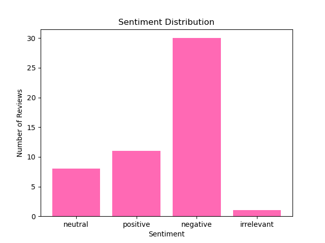

# Review Sentiment Analysis Pipeline

Python pipeline that classifies customer reviews as **positive**, **neutral**, **negative**, or **irrelevant** using the OpenAI API.

---

## Overview

The project automates sentiment labeling for product reviews.  
It reads a JSON file of reviews, classifies each with the OpenAI API, saves labeled output, and generates a sentiment distribution plot.

---

## Features

- Sentiment classification via OpenAI GPT model  
- JSON-based input and output  
- Visualization of sentiment ratios  
- Error handling for invalid inputs  
- Modular structure for easy reuse and testing  

---

## Project Structure

```
├── src/
│   ├── label.py
│   ├── main.py
│   ├── visualize.py
│   └── __init__.py
├── tests/
│   ├── config.py
│   ├── test_label.py
│   ├── test_run.py
│   ├── test_visualize.py
│   └── __init__.py
├── data/
│   ├── reviews.json
│   └── labeled_reviews.json
├── images/
│   └── sentiments.png
└── README.md
```

---

## Setup

1. **Activate your conda environment**
   ```bash
   conda activate ds
   ```

2. **Add your OpenAI API key**
   ```bash
   conda env config vars set OPENAI_API_KEY="your_api_key"
   conda deactivate ds
   conda activate ds
   ```

3. **Install dependencies**
   ```bash
   pip install openai matplotlib
   ```

4. **Verify installation**
   ```bash
   python tests/test_label.py
   ```
   A successful setup will print `SUCCESS!`.

---

## Usage

Run the main pipeline to analyze reviews and generate a sentiment plot:

```bash
python -m src.main
```

This will:
- Read reviews from `data/reviews.json`
- Classify each review as positive, neutral, negative, or irrelevant
- Save labeled results to `data/labeled_reviews.json`
- Create a visualization in `images/`

### Output Visualization

After running the pipeline, a sentiment distribution chart is saved in `images/`.



---

## Example

**Input**
```json
["I love this ring!", "It's fine.", "Terrible product."]
```

**Output**
```json
["positive", "neutral", "negative"]
```

---

## Insights from the Analysis

**Most Common Sentiment:**  
Negative reviews were the most frequent among the 50 analyzed samples.

**Model Reliability:**  
The labels were generally reliable after refining the prompt and controlling the API input.  
However, LLMs can still mislabel or produce inconsistent outputs, so results should always be verified before drawing conclusions.

**Recommendation:**  
Since most feedback was negative—mainly about the product’s taste—the company should focus on improving flavor quality or returning to the original formula.  
This presents an opportunity to rebuild customer trust and satisfaction.

## Author

**Gennadii Ershov**  
[GitHub](https://github.com/imwaymaran/imwaymaran) • [LinkedIn](http://linkedin.com/in/gennadii-alb-ershov)